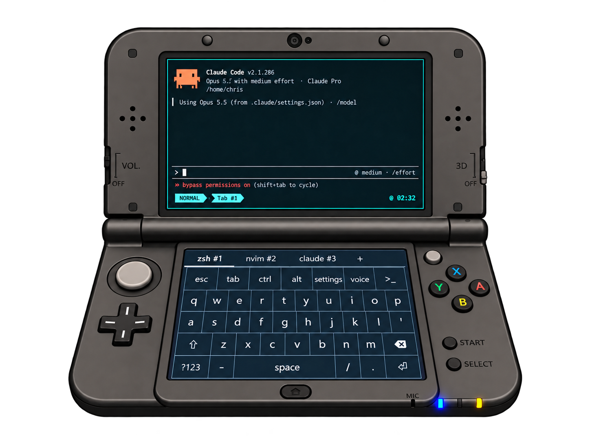

# Pocket Term — Omarchy

<p align="center"></p>

Pocket Term is a Nintendo 3DS terminal client with an Omarchy companion. It was originally forked from [Pocket Term](https://github.com/pocket-stack/pocket-term). Run shells on your Omarchy host from the 3DS with a touch keyboard and session tabs. The `>_` menu gives quick access to tools such as nvim and Git commands. Voice dictation is extremely fast and runs on the Omarchy host's Voxtype, which is pre-installed on all Omarchy installations. 

Press the voice key once to start dictation, and again to end it.

<p></p>
<p></p>

Configure the tools and options in [config.jsonc](config.jsonc). You can create your own macros like "Long holding A turns it into holding Alt." (Extremely handy when you're multiplexing.)

Hitting select turns the keyboard into a directory selector. Long pressing the ctrl key launches a ctrl submenu. All of these key presses and menu options are customizable.

Pocket Term uses a customized [PocketJS checkout](https://github.com/chrispository/pocketjs); Most of the changes will likely NOT make it upstream to the original PocketJS as I ended up needing to make LOTS of changes to port from Mac to Linux and to bring latency down significantly. Point your coding agent to my forked PocketJS and this repository, and tell your agent to build pocket-term-omarchy using that forked version of PocketJS. 

To connect, get your console's IP from ftpd, exit ftpd, then launch Pocket Term from Homebrew Launcher. With Pocket Term running on your 3DS, run this on your Omarchy machine. A future version will likely include some sort of "listener" so that you can start everything from the 3DS, but I haven't buit that yet:

```sh
bun run daemon --device <console-ip>
```

Keep the daemon running while you use Pocket Term. For full setup instructions, controls, and technical details, see the [original README](https://github.com/chrispository/pocket-term-omarchy/blob/c1ac365786df8610d5c4f0659d84d13464380702/README.md).

Pocket Term is MIT licensed; PocketJS, libghostty, and the bundled fonts have their own licenses. See the [font sources](assets/fonts/README.md) for font licenses and provenance.
