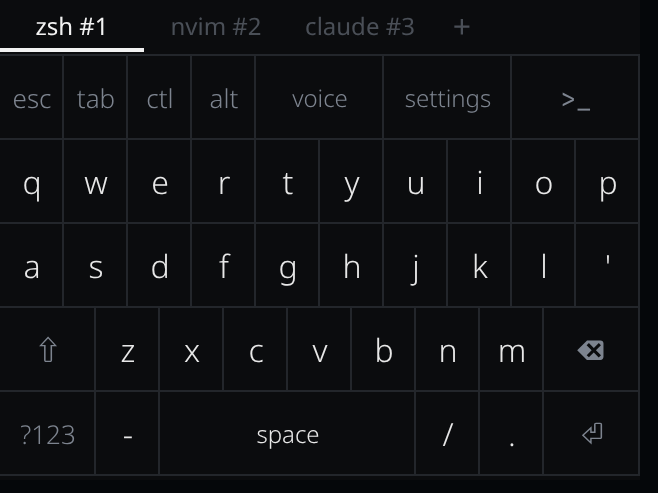
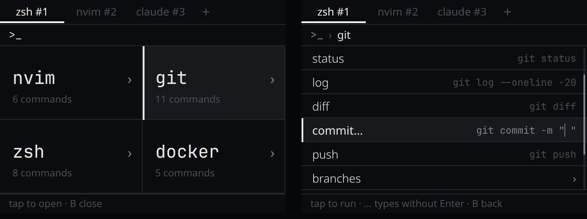

# Pocket Term — Omarchy

Pocket Term is a Nintendo 3DS terminal client with an Omarchy companion. Run shells on your computer from the 3DS with a touch keyboard and session tabs. The `>_` menu gives quick access to tools such as nvim and Git commands.

<p></p>
<p></p>

Pocket Term uses a customized [PocketJS checkout](https://github.com/chrispository/pocketjs); point your coding agent at it and ask it to build this repository. To connect, get your console's IP from ftpd, exit ftpd, then launch Pocket Term from Homebrew Launcher. With Pocket Term running, start the companion from this repository on your computer:

```sh
bun run daemon --device <console-ip>
```

Keep the daemon running while you use Pocket Term. For full setup instructions, controls, and technical details, see the [original README](https://github.com/chrispository/pocket-term-omarchy/blob/c1ac365786df8610d5c4f0659d84d13464380702/README.md).
